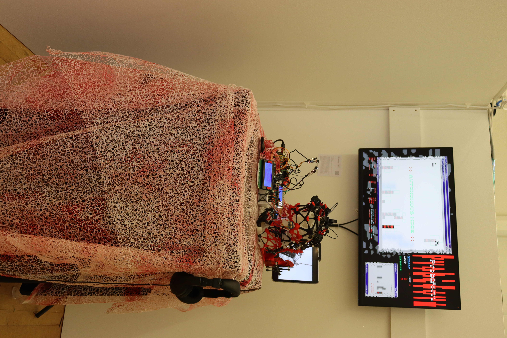
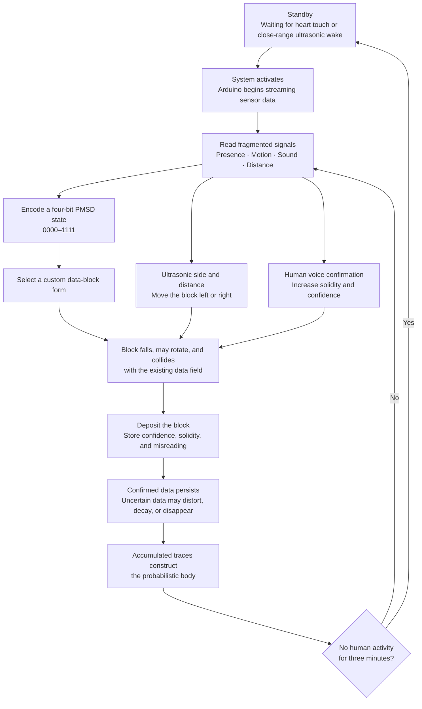
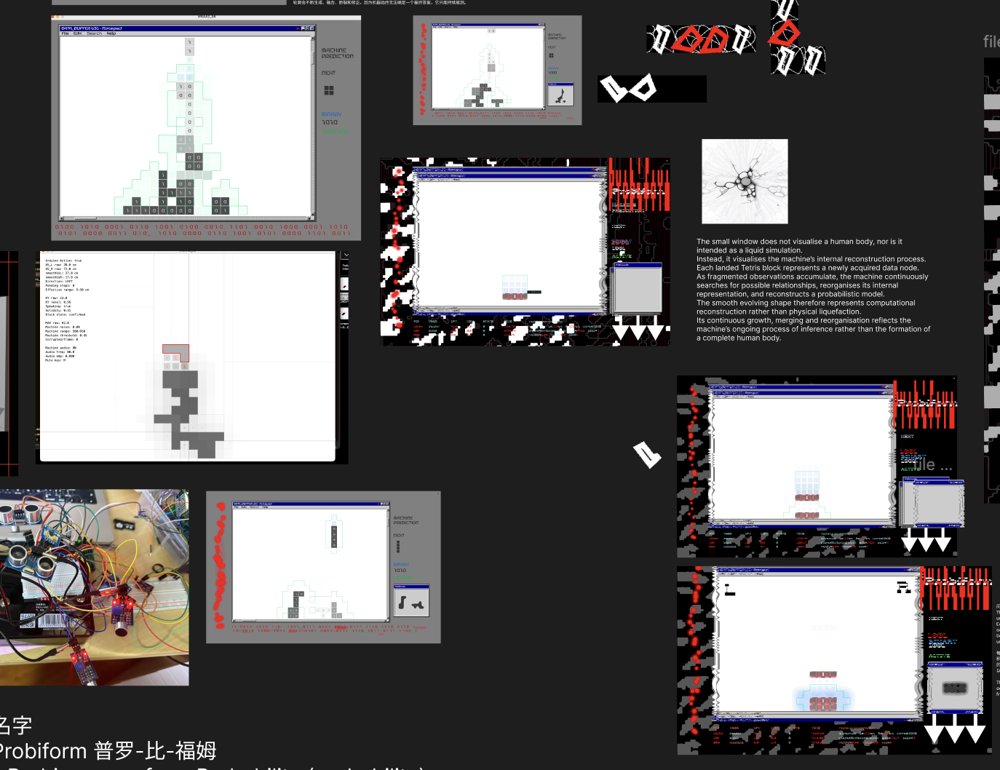

# Probiform

**Data Sedimentation — Constructing a Probabilistic Body**



*Final installation view of Probiform.*

## Project Overview

*Probiform* is an interactive installation that asks how a machine might infer a human presence without using a camera. A low-resolution sensing network of ultrasonic sensors, microphones, and millimetre-wave radar collects fragmented signals of distance, movement, sound, and proximity. None of these measurements describes a complete person. Instead, the system filters, combines, and sometimes misreads them to construct a temporary machine-readable representation: a **probabilistic body**.

Participants alter the installation through movement and sound. Each sensor state is encoded as a four-bit PMSD value—Presence, Motion, Sound, and Distance—and translated into a custom Tetris-like data block. The blocks fall, rotate, collide, and accumulate over time. Tetris is therefore not used as a literal image of the body, but as a visual model of data sedimentation: isolated observations gradually become a structure that appears coherent while remaining partial, unstable, and open to error. The work makes machine inference visible as an ongoing act of construction rather than objective recognition.


*Detail view of the sensing apparatus and its material construction.*

## Concept and Research

The project began with a concern about how computational systems turn incomplete observations into apparently complete identities. Machine perception often presents its classifications as facts, even though every result depends on sensor limits, thresholds, training assumptions, and interpretation. *Probiform* moves this process into an installation where uncertainty is not hidden. The machine never sees a participant as a whole; it can only assemble a **data body** from traces.

The term **probabilistic body** describes this unstable representation. It is neither a portrait nor a digital copy of the participant. It is a changing hypothesis produced through machine perception: a body that becomes more or less plausible as signals accumulate, conflict, disappear, or are misread.

The installation deliberately avoids cameras and facial recognition. A camera would introduce a detailed visual image and encourage identification, surveillance, and recognition of individual features. By using low-resolution, non-visual sensors, the work limits what the machine can know. This constraint shifts attention from who a person is to how a technical system claims that a person is present.

### Research Questions

The primary research question is:

> How can a machine construct a representation of human presence from fragmented, non-visual sensor data, and how can an interactive installation reveal the uncertainty and misinterpretation within that process?

Supporting questions include:

- When does accumulated data begin to appear like a coherent body?
- How do thresholds, confidence values, and sensor errors shape machine perception?
- Can a data body remain legible while refusing photographic or biometric identification?
- How can interaction expose inference as a process rather than present it as a neutral result?

### Theoretical Context

Vilém Flusser's writing on apparatuses and technical images provides a key reference for the project. His work treats technical images not simply as transparent records of reality, but as outputs shaped by programmed apparatuses. *Probiform* extends this concern beyond photography: its sensor readings, confidence values, and generated forms are also technical images produced by a system with defined limits and possibilities. The participant can act within this system, but the apparatus determines how those actions become data.

Nick Couldry and Ulises A. Mejias's concept of **data colonialism** situates this transformation within a wider political economy. They argue that contemporary systems appropriate everyday human life as data for capitalist extraction. This perspective helps frame sensing in *Probiform* as more than a technical operation: converting presence into data is also an act of capture, classification, and power. The installation responds by exposing this conversion rather than presenting data collection as frictionless or neutral.

N. Katherine Hayles's account of the **posthuman** challenges the idea that information can be separated cleanly from the material bodies that produce and carry it. This is central to the project's distinction between a living participant and a data body. The probabilistic body is not the participant made virtual; it is a partial computational construction whose apparent coherence depends on hardware, code, environmental conditions, and embodied action.

Rafael Lozano-Hemmer's *Pulse Room* (2006) is an important artistic precedent for transforming biometric data into a physical and accumulated trace. In that installation, participants' heartbeats are recorded as pulses of light and move through a queue of hanging bulbs. *Probiform* shares this interest in making bodily data spatial, collective, and temporal, but replaces a single biometric measurement with an uncertain combination of non-visual sensor readings. Its accumulated forms therefore register not only presence, but also the machine's confidence, gaps, and misinterpretations.

## How It Works

The interaction follows a continuous inference loop:

> **Presence detected → system activates → distance determines direction → sound confirms blocks → data accumulates → the machine constructs a body**



### What Each Signal Does

| Signal | Source | Effect in the system |
| --- | --- | --- |
| **Presence (P)** | Active sensor system and close-range participant evidence | Enables participant-driven data generation; without presence, the direct PMSD state is `0000` |
| **Motion (M)** | Changes in ultrasonic distance and left/right movement | Sets the motion bit and contributes to the selected block form |
| **Sound (S)** | Human voice detected above the calibrated room baseline | Sets the sound bit; a sustained recent voice can confirm a landing, raise confidence, and make the deposited block more solid |
| **Distance (D)** | Left and right ultrasonic sensors | Sets the distance bit, chooses left/right control, and maps proximity to one, two, or three horizontal movement steps |

### Using the Installation

1. **Start the system.** Touch the MAX30102 heart-rate sensor, or approach closely enough for the ultrasonic wake detection to respond.
2. **Move the data.** Stand on the left or right side of the sensing field. The corresponding ultrasonic sensor moves the active block in that direction; closer readings produce larger movements.
3. **Confirm with sound.** Speak or make a sustained sound above the calibrated human-voice baseline. Voice confirmation increases the block's confidence and solidity when it lands.
4. **Watch the inference accumulate.** Each PMSD combination generates a different form. Blocks fall, rotate, overlap, persist, distort, or decay according to the strength and consistency of the evidence.
5. **Leave or continue.** Ongoing interaction repeats the sensing loop. After three minutes without human activity, the hardware returns to its waiting state; exhibition mode may continue producing visibly low-confidence environmental inferences.

Without connected hardware, press `T` to enter keyboard test mode and use the controls documented below to simulate the same signal states.

## Development Process

### Visual and Interaction Iterations

**Documentation date:** 2 August 2026

**Stages represented:** sensor experiments, Tetris prototype, machine misreading, and interface development



*Development collage documenting the movement from separate sensor and Tetris experiments toward the integrated Probiform interface.*

**What I did:** The collage brings together an early breadboard sensor test, initial white Processing interfaces, custom binary Tetris forms, Windows 95-inspired frames, red conflict indicators, and experiments with the smaller reconstructed-body window. These tests gradually connected the physical sensing system to a visual language of data accumulation.

**Problem:** In the early prototypes, sensor values, falling blocks, and machine interpretation appeared as separate technical outputs. The interface showed that data was being collected, but it did not yet communicate the difference between confirmed evidence, uncertain inference, and machine misreading.

**How I changed it:** I introduced a clearer visual hierarchy and used different visual states to express confidence. Grey and black forms indicate degrees of confirmation and solidity, while red elements expose conflict, corruption, and contradictory input. The interface developed from a mostly white functional prototype into a Windows 95-inspired system with dedicated data panels, a machine-perception boundary, and a smaller liquefaction view that reconstructs accumulated traces rather than displaying a literal body.

This image records several stages together. Individual stage dates should be added when the original sketches, screenshots, or photographs can be matched to their source files.

## System Overview

The project has two parts:

- `WSAA2_06/`: the main Processing application, responsible for visuals, interaction logic, sound, and OSC
- `Arduino_Probiform_Printer_Bridge/`: Arduino Mega 2560 firmware that reads sensors, drives two LCDs, controls the LD2410, and communicates with Processing over USB serial

## Visual Language

Tetris functions as a visual language of data sedimentation rather than a representation of the body itself. Each block represents a fragment of information received by the machine at a particular moment. As data accumulates over time, these fragments gradually form a larger structure, revealing how technical systems construct and organise representations from incomplete evidence.

### PMSD Tetris Form Library

The following forms were designed for the active PMSD states currently used by the installation. Each four-bit label corresponds to **Presence, Motion, Sound, and Distance**. Rather than using conventional Tetris pieces, the project translates different combinations of sensed information into a custom machine-like form. These forms fall, rotate, overlap, and accumulate to construct the evolving probabilistic body.


## Features

- Combines Presence, Motion, Sound, and Distance into 4-bit PMSD data
- Generates, rotates, and deposits forms according to sensor data
- Displays real-time data in a Windows 95-inspired interface
- Synthesizes a machine soundscape from the system state
- Sends real-time parameters to Max/MSP via OSC
- Automatically generates a 192 × 128 thermal-printer image after every 15 deposited data blocks
- Supports a keyboard test mode when no Arduino is connected
- Automatically enters inference and looping display states when no participant is present

## Requirements

### Processing

- Processing 4
- Sound library
- oscP5 library
- Serial library (included with Processing)

Install any missing libraries in the Processing IDE through **Sketch → Import Library → Manage Libraries…**.

### Arduino

- Arduino Mega 2560
- `LiquidCrystal_I2C`
- SparkFun `MAX3010x Sensor Library`
- Adafruit `Thermal Printer Library`

The Mega 2560 is required because the firmware uses USB serial, `Serial1`, and `Serial2` simultaneously.

## Quick Start (Without Hardware)

1. Open `WSAA2_06/WSAA2_06.pde` in Processing.
2. Install the Sound and oscP5 libraries.
3. Run the sketch; the application starts in full-screen mode.
4. Press `T` to enable keyboard test mode.
5. Use the arrow keys or `W/A/S/D` to control data blocks, and use `0`–`8` to simulate different PMSD inputs.

The application automatically loads interface images and the `0000.png`–`1111.png` form assets from the project root, and fonts from `WSAA2_06/data/`.

## Running the Complete Installation

1. Connect the hardware according to the wiring table below and ensure all modules share a common ground.
2. Open and upload `Arduino_Probiform_Printer_Bridge/Arduino_Probiform_Printer_Bridge.ino` in the Arduino IDE.
3. Close the Arduino Serial Monitor so that it does not occupy the serial port.
4. Start the Processing sketch.
5. Processing first looks for a serial port whose name contains `usbmodem`, `usbserial`, or `arduino`; if none is found, it tries the first port in the list.
6. Touch the MAX30102 heart-rate sensor to begin data acquisition. While idle, the system can also wake when the ultrasonic sensors detect an audience member.

The USB serial baud rate is `115200`. The system automatically sleeps after three continuous minutes without detecting a participant.

## Hardware Connections

| Module | Arduino Mega 2560 | Description |
| --- | --- | --- |
| Left ultrasonic TRIG | D2 | Distance input |
| Left ultrasonic ECHO | D3 | Distance input; observe the module's logic-level requirements |
| Right ultrasonic TRIG | D4 | Distance input |
| Right ultrasonic ECHO | D5 | Distance input; observe the module's logic-level requirements |
| Front-left MAX9814 | A0 | Machine-feedback sound |
| Front-right MAX9814 | A1 | Machine-feedback sound |
| Rear-left KY-038 | A2 | Human-voice confirmation |
| Rear-right KY-038 | A3 | Human-voice confirmation |
| LD2410 power relay | D22 | Active-high by default; adjust the firmware constant for the relay type |
| Data LCD | SDA 20 / SCL 21 | I2C address `0x27`, 20 × 4 |
| Print LCD | SDA 20 / SCL 21 | I2C address `0x26`, 20 × 4 |
| MAX30102 | SDA 20 / SCL 21 | I2C heart-rate/touch activation sensor |
| Thermal printer TTL | Serial1, TX1 D18 | `9600` baud |
| LD2410 | Serial2, RX2 D17 / TX2 D16 | `256000` baud |
| Processing host | USB `Serial` | `115200` baud |

> Thermal printers usually require a separate high-current power supply. Do not power the printer directly from the Arduino's 5V pin, and make sure the printer power ground and Arduino GND are connected. Consult the specific module's datasheet before wiring it.

The two LCDs must use different I2C addresses. If their actual addresses differ, update `DATA_LCD_ADDRESS` and `PRINT_LCD_ADDRESS` in the firmware.

## Controls

### General Controls

| Key | Function |
| --- | --- |
| `A` / `←` | Move left |
| `D` / `→` | Move right |
| `W` / `↑` | Rotate |
| `S` / `↓` | Accelerate downward movement |
| `Space` | Inject one conflict/misreading event |
| `C` | Clear deposited data |
| `M` | Toggle machine sound |
| `B` | Recalibrate the human-voice baseline |
| `U` | Connect/disconnect the Arduino serial port |
| `V` | Send the stop-system command to the Arduino |
| `P` | Manually print the current liquefaction image (hardware mode) |
| `I` | Print the current sensor status (hardware mode) |
| `T` | Toggle keyboard test mode |

### Keyboard Test Mode

| Key | Function |
| --- | --- |
| `0`–`8` | Simulate different PMSD states |
| `P` | Toggle Presence |
| `O` | Toggle Distance |
| `[` / `]` | Decrease/increase the simulated distance |
| `Q` / `E` | Decrease/increase the simulated human-voice input |
| `Z` / `X` | Decrease/increase the simulated machine-sound input |

## PMSD Data

The system combines four types of observations into a 4-bit state:

- **P — Presence**: whether an audience member is present
- **M — Motion**: whether movement is detected
- **S — Sound**: whether a human voice is detected
- **D — Distance**: whether the participant is within the effective interaction range

These values affect the form type, spatial position, confidence, degree of solidification, and probability of misreading. The installation does not treat sensor readings as absolute facts; it uses them as the basis for continuously changing inferences.

## OSC / Max/MSP

Processing creates an OSC instance on local port `12000` and sends the following values to `127.0.0.1:7400` at approximately 20 Hz:

| OSC Address | Type | Content |
| --- | --- | --- |
| `/distanceL` | float | Smoothed left-side distance |
| `/distanceR` | float | Smoothed right-side distance |
| `/voice` | float | Human-voice intensity |
| `/confidence` | float | Current data confidence |
| `/misread` | float | Current misreading/conflict amount |
| `/rotation` | int | Current form rotation state |
| `/drop` | int | Data-drop event; value is `1` |

When Max/MSP is not running, Processing's visuals and internal sound system still operate independently.

## Thermal Printing

Processing converts the current liquefaction field into a `192 × 128` 1-bit bitmap and sends it to the Arduino line by line over USB serial. The Arduino then drives the printer through `Serial1`.

- Automatic print interval: every 15 deposited data blocks
- Manually print the current image: `P`
- Print a status ticket: `I`
- Serial commands supported by the firmware: `PRINT_BITMAP`, `PRINT_TEST`, `PRINT_STATUS`, `STOP_SYSTEM`

Normal sensor acquisition pauses during printing and resumes automatically when printing is complete.

## Project Structure

```text
.
├── Arduino_Probiform_Printer_Bridge/
│   └── Arduino_Probiform_Printer_Bridge.ino
├── WSAA2_06/
│   ├── WSAA2_06.pde                 # Processing entry point and main loop
│   ├── Sensors.pde                  # Serial connection, sensor mapping, and participation state
│   ├── GameInputData.pde            # Input, PMSD, and falling-block data
│   ├── SedimentSystem.pde           # Deposition, decay, and gravity
│   ├── MemoryBoundary.pde           # Trails, conflicts, and perception boundaries
│   ├── LiquefactionField.pde        # Liquefaction-field visuals
│   ├── BlockDrawing.pde             # Data-block rendering
│   ├── InterfaceView.pde            # Interface and HUD
│   ├── MachineSound.pde             # Real-time sound synthesis
│   ├── OscBridge.pde                # OSC output
│   ├── ThermalPrintBridge.pde       # Bitmap generation and printer communication
│   └── data/                         # Font assets
├── 0000.png … 1111.png              # 4-bit form assets
└── Other PNG / SVG files             # Interface visual assets
```

## Troubleshooting

**Processing reports that it cannot find a serial port**
Confirm that the Arduino is connected and the Serial Monitor is closed, then press `U` to reconnect. If multiple serial devices are connected, specify the port explicitly in `initArduinoSerial()` in `Sensors.pde`.

**Processing reports a missing class during compilation**
Confirm that Sound and oscP5 are installed. On the Arduino side, check that all three external libraries are installed.

**The LCDs show nothing**
Use an I2C scanner to confirm the addresses and make sure the two displays do not use the same address.

**The printer produces garbled output, resets, or prints too lightly**
Check the separate power supply, common ground, and `9600` baud rate. Print density and heating parameters can be adjusted in `ThermalPrintBridge.pde` and the Arduino firmware, respectively.

**Testing the visuals without hardware**
Press `T` to enter keyboard test mode, then use `0`–`8`, `[`, `]`, `Q/E`, and `Z/X` to simulate input.

## Notes

This project is still in the installation-development stage. Before a public exhibition, recalibrate the sound thresholds, effective ultrasonic range, LD2410 sensitivity, and thermal-printer heating parameters for the venue.

## References

Couldry, N. and Mejias, U.A. (2019) *The Costs of Connection: How Data Is Colonizing Human Life and Appropriating It for Capitalism*. Stanford, CA: Stanford University Press. Available at: [https://www.sup.org/books/sociology/costs-connection](https://www.sup.org/books/sociology/costs-connection) (Accessed: 20 August 2026).

Dourish, P. (2001) *Where the Action Is: The Foundations of Embodied Interaction*. Cambridge, MA: MIT Press. Available at: [https://mitpress.mit.edu/9780262541787/where-the-action-is/](https://mitpress.mit.edu/9780262541787/where-the-action-is/) (Accessed: 14 August 2026).

Flusser, V. (2000) *Towards a Philosophy of Photography*. Translated by A. Mathews. London: Reaktion Books. Available at: [https://reaktionbooks.co.uk/work/towards-a-philosophy-of-photography](https://reaktionbooks.co.uk/work/towards-a-philosophy-of-photography) (Accessed: 24 August 2026).

Flusser, V. (2011) *Into the Universe of Technical Images*. Translated by N.A. Roth. Minneapolis, MN: University of Minnesota Press. Available at: [https://www.upress.umn.edu/9780816670215/into-the-universe-of-technical-images/](https://www.upress.umn.edu/9780816670215/into-the-universe-of-technical-images/) (Accessed: 12 August 2026).

Gitelman, L. (ed.) (2013) *“Raw Data” Is an Oxymoron*. Cambridge, MA: MIT Press. Available at: [https://mitpress.mit.edu/9780262518284/raw-data-is-an-oxymoron/](https://mitpress.mit.edu/9780262518284/raw-data-is-an-oxymoron/) (Accessed: 30 August 2026).

Hansen, M.B.N. (2006) *Bodies in Code: Interfaces with Digital Media*. New York: Routledge. Available at: [https://www.routledge.com/Bodies-in-Code-Interfaces-with-Digital-Media/Hansen/p/book/9780415970167](https://www.routledge.com/Bodies-in-Code-Interfaces-with-Digital-Media/Hansen/p/book/9780415970167) (Accessed: 30 August 2026).

Hansen, M.B.N. (2015) *Feed-Forward: On the Future of Twenty-First-Century Media*. Chicago, IL: University of Chicago Press. Available at: [https://press.uchicago.edu/ucp/books/book/chicago/F/bo19211873.html](https://press.uchicago.edu/ucp/books/book/chicago/F/bo19211873.html) (Accessed: 1 August 2026).

Hayles, N.K. (1999) *How We Became Posthuman: Virtual Bodies in Cybernetics, Literature, and Informatics*. Chicago, IL: University of Chicago Press. Available at: [https://press.uchicago.edu/ucp/books/book/chicago/H/bo3769963.html](https://press.uchicago.edu/ucp/books/book/chicago/H/bo3769963.html) (Accessed: 24 August 2026).

Lozano-Hemmer, R. (2006) *Pulse Room* [Interactive installation]. Incandescent light bulbs, heart-rate sensors, computer and metal sculpture. Available at: [https://www.lozano-hemmer.com/artworks/pulse_room.php](https://www.lozano-hemmer.com/artworks/pulse_room.php) (Accessed: 24 August 2026).

Lozano-Hemmer, R. (2008) *Pulse Park* [Interactive installation]. New York: Madison Square Park. Available at: [https://www.lozano-hemmer.com/pulse_park.php](https://www.lozano-hemmer.com/pulse_park.php) (Accessed: 24 August 2026).

Manovich, L. (2001) *The Language of New Media*. Cambridge, MA: MIT Press. Available at: [https://mitpress.mit.edu/9780262296915/the-language-of-new-media/](https://mitpress.mit.edu/9780262296915/the-language-of-new-media/) (Accessed: 24 August 2026).

Parisi, L. (2013) *Contagious Architecture: Computation, Aesthetics, and Space*. Cambridge, MA: MIT Press. Available at: [https://mitpress.mit.edu/9780262529341/contagious-architecture](https://mitpress.mit.edu/9780262529341/contagious-architecture) (Accessed: 30 August 2026).

Whitelaw, M. (2004) *Metacreation: Art and Artificial Life*. Cambridge, MA: MIT Press. Available at: [https://mitpress.mit.edu/9780262731768/metacreation](https://mitpress.mit.edu/9780262731768/metacreation) (Accessed: 24 August 2026).

## Generative AI Acknowledgement

I acknowledge the use of ChatGPT ([https://chat.openai.com/](https://chat.openai.com/)) to assist with selected aspects of code development and debugging, provide suggestions on specific technical issues, and support language editing during the development of this assessment. I entered prompts including the following between **6 July and 2 August 2026**:

- **Assist with developing and debugging selected functions in the Processing interface, particularly responsive layout behaviour, while retaining the existing Windows 95-inspired visual direction and interaction logic.**  

- **Assist with connecting the Arduino Mega 2560 to the Processing program and debugging USB serial communication for ultrasonic, sound, heart-rate/touch, and LD2410 radar data, including port selection, baud-rate configuration, data formatting, and parsing.**  

- **Suggest an implementation approach for replacing the previous thermal-printing output with a locally generated QR-code archive, including automatic generation and manual display controls.**  

- **Help improve the clarity and bilingual wording of selected sections of the project documentation without changing their technical meaning.**  

The outputs were treated as suggestions rather than final material. Relevant suggestions were evaluated, adapted, and tested by the author before use. The project's concept, research direction, interaction design, visual and sound decisions, hardware implementation, and final presentation were developed and determined by the author. The author accepts responsibility for the accuracy, integrity, and final outcome of the submitted work.
