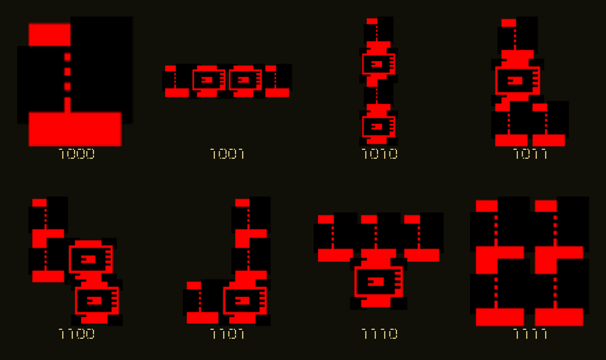

# Probiform Game

**Data Sedimentation — Constructing a Probabilistic Body**

*Machine Inference and the Probabilistic Body* is an interactive installation that explores how machines construct representations of human presence from fragmented and incomplete information.

Instead, the system uses a low-resolution non-visual sensing network consisting of ultrasonic sensors, sound sensors, and millimeter-wave radar. These sensors can only detect partial signals such as distance, sound, and movement. Through continuous accumulation, interpretation, filtering, and misinterpretation of these signals, the system gradually constructs a machine-readable representation of human presence, which I describe as a Probabilistic Body.

Participants interact with the installation through movement and sound. Distance data influences the spatial behaviour of falling data blocks, while sound affects the machine’s confidence in the information it receives. The machine simultaneously listens to both human-generated sounds and sounds produced by its own electronic components, creating a feedback loop between human and machine perception.

The project has two parts:

- `WSAA2_06/`: the main Processing application, responsible for visuals, interaction logic, sound, and OSC
- `Arduino_Probiform_Printer_Bridge/`: Arduino Mega 2560 firmware that reads sensors, drives two LCDs, controls the LD2410, and communicates with Processing over USB serial

## Visual Language

Tetris functions as a visual language of data sedimentation rather than a representation of the body itself. Each block represents a fragment of information received by the machine at a particular moment. As data accumulates over time, these fragments gradually form a larger structure, revealing how technical systems construct and organise representations from incomplete evidence.

### PMSD Tetris Form Library

The following forms were designed for the active PMSD states currently used by the installation. Each four-bit label corresponds to **Presence, Motion, Sound, and Distance**. Rather than using conventional Tetris pieces, the project translates different combinations of sensed information into a custom machine-like form. These forms fall, rotate, overlap, and accumulate to construct the evolving probabilistic body.



## Features

- Combines Presence, Motion, Sound, and Distance into 4-bit PMSD data
- Generates, rotates, and deposits forms according to sensor data
- Displays real-time data in a Windows 95-inspired interface
- Synthesizes a machine soundscape from the system state
- Sends real-time parameters to Max/MSP via OSC
- Automatically generates a 192 × 128 thermal-printer image after every 15 deposited data blocks
- Supports a keyboard test mode when no Arduino is connected
- Automatically enters inference and looping display states when no participant is present

## Requirements

### Processing

- Processing 4
- Sound library
- oscP5 library
- Serial library (included with Processing)

Install any missing libraries in the Processing IDE through **Sketch → Import Library → Manage Libraries…**.

### Arduino

- Arduino Mega 2560
- `LiquidCrystal_I2C`
- SparkFun `MAX3010x Sensor Library`
- Adafruit `Thermal Printer Library`

The Mega 2560 is required because the firmware uses USB serial, `Serial1`, and `Serial2` simultaneously.

## Quick Start (Without Hardware)

1. Open `WSAA2_06/WSAA2_06.pde` in Processing.
2. Install the Sound and oscP5 libraries.
3. Run the sketch; the application starts in full-screen mode.
4. Press `T` to enable keyboard test mode.
5. Use the arrow keys or `W/A/S/D` to control data blocks, and use `0`–`8` to simulate different PMSD inputs.

The application automatically loads interface images and the `0000.png`–`1111.png` form assets from the project root, and fonts from `WSAA2_06/data/`.

## Running the Complete Installation

1. Connect the hardware according to the wiring table below and ensure all modules share a common ground.
2. Open and upload `Arduino_Probiform_Printer_Bridge/Arduino_Probiform_Printer_Bridge.ino` in the Arduino IDE.
3. Close the Arduino Serial Monitor so that it does not occupy the serial port.
4. Start the Processing sketch.
5. Processing first looks for a serial port whose name contains `usbmodem`, `usbserial`, or `arduino`; if none is found, it tries the first port in the list.
6. Touch the MAX30102 heart-rate sensor to begin data acquisition. While idle, the system can also wake when the ultrasonic sensors detect an audience member.

The USB serial baud rate is `115200`. The system automatically sleeps after three continuous minutes without detecting a participant.

## Hardware Connections

| Module | Arduino Mega 2560 | Description |
| --- | --- | --- |
| Left ultrasonic TRIG | D2 | Distance input |
| Left ultrasonic ECHO | D3 | Distance input; observe the module's logic-level requirements |
| Right ultrasonic TRIG | D4 | Distance input |
| Right ultrasonic ECHO | D5 | Distance input; observe the module's logic-level requirements |
| Front-left MAX9814 | A0 | Machine-feedback sound |
| Front-right MAX9814 | A1 | Machine-feedback sound |
| Rear-left KY-038 | A2 | Human-voice confirmation |
| Rear-right KY-038 | A3 | Human-voice confirmation |
| LD2410 power relay | D22 | Active-high by default; adjust the firmware constant for the relay type |
| Data LCD | SDA 20 / SCL 21 | I2C address `0x27`, 20 × 4 |
| Print LCD | SDA 20 / SCL 21 | I2C address `0x26`, 20 × 4 |
| MAX30102 | SDA 20 / SCL 21 | I2C heart-rate/touch activation sensor |
| Thermal printer TTL | Serial1, TX1 D18 | `9600` baud |
| LD2410 | Serial2, RX2 D17 / TX2 D16 | `256000` baud |
| Processing host | USB `Serial` | `115200` baud |

> Thermal printers usually require a separate high-current power supply. Do not power the printer directly from the Arduino's 5V pin, and make sure the printer power ground and Arduino GND are connected. Consult the specific module's datasheet before wiring it.

The two LCDs must use different I2C addresses. If their actual addresses differ, update `DATA_LCD_ADDRESS` and `PRINT_LCD_ADDRESS` in the firmware.

## Controls

### General Controls

| Key | Function |
| --- | --- |
| `A` / `←` | Move left |
| `D` / `→` | Move right |
| `W` / `↑` | Rotate |
| `S` / `↓` | Accelerate downward movement |
| `Space` | Inject one conflict/misreading event |
| `C` | Clear deposited data |
| `M` | Toggle machine sound |
| `B` | Recalibrate the human-voice baseline |
| `U` | Connect/disconnect the Arduino serial port |
| `V` | Send the stop-system command to the Arduino |
| `P` | Manually print the current liquefaction image (hardware mode) |
| `I` | Print the current sensor status (hardware mode) |
| `T` | Toggle keyboard test mode |

### Keyboard Test Mode

| Key | Function |
| --- | --- |
| `0`–`8` | Simulate different PMSD states |
| `P` | Toggle Presence |
| `O` | Toggle Distance |
| `[` / `]` | Decrease/increase the simulated distance |
| `Q` / `E` | Decrease/increase the simulated human-voice input |
| `Z` / `X` | Decrease/increase the simulated machine-sound input |

## PMSD Data

The system combines four types of observations into a 4-bit state:

- **P — Presence**: whether an audience member is present
- **M — Motion**: whether movement is detected
- **S — Sound**: whether a human voice is detected
- **D — Distance**: whether the participant is within the effective interaction range

These values affect the form type, spatial position, confidence, degree of solidification, and probability of misreading. The installation does not treat sensor readings as absolute facts; it uses them as the basis for continuously changing inferences.

## OSC / Max/MSP

Processing creates an OSC instance on local port `12000` and sends the following values to `127.0.0.1:7400` at approximately 20 Hz:

| OSC Address | Type | Content |
| --- | --- | --- |
| `/distanceL` | float | Smoothed left-side distance |
| `/distanceR` | float | Smoothed right-side distance |
| `/voice` | float | Human-voice intensity |
| `/confidence` | float | Current data confidence |
| `/misread` | float | Current misreading/conflict amount |
| `/rotation` | int | Current form rotation state |
| `/drop` | int | Data-drop event; value is `1` |

When Max/MSP is not running, Processing's visuals and internal sound system still operate independently.

## Thermal Printing

Processing converts the current liquefaction field into a `192 × 128` 1-bit bitmap and sends it to the Arduino line by line over USB serial. The Arduino then drives the printer through `Serial1`.

- Automatic print interval: every 15 deposited data blocks
- Manually print the current image: `P`
- Print a status ticket: `I`
- Serial commands supported by the firmware: `PRINT_BITMAP`, `PRINT_TEST`, `PRINT_STATUS`, `STOP_SYSTEM`

Normal sensor acquisition pauses during printing and resumes automatically when printing is complete.

## Project Structure

```text
.
├── Arduino_Probiform_Printer_Bridge/
│   └── Arduino_Probiform_Printer_Bridge.ino
├── WSAA2_06/
│   ├── WSAA2_06.pde                 # Processing entry point and main loop
│   ├── Sensors.pde                  # Serial connection, sensor mapping, and participation state
│   ├── GameInputData.pde            # Input, PMSD, and falling-block data
│   ├── SedimentSystem.pde           # Deposition, decay, and gravity
│   ├── MemoryBoundary.pde           # Trails, conflicts, and perception boundaries
│   ├── LiquefactionField.pde        # Liquefaction-field visuals
│   ├── BlockDrawing.pde             # Data-block rendering
│   ├── InterfaceView.pde            # Interface and HUD
│   ├── MachineSound.pde             # Real-time sound synthesis
│   ├── OscBridge.pde                # OSC output
│   ├── ThermalPrintBridge.pde       # Bitmap generation and printer communication
│   └── data/                         # Font assets
├── 0000.png … 1111.png              # 4-bit form assets
└── Other PNG / SVG files             # Interface visual assets
```

## Troubleshooting

**Processing reports that it cannot find a serial port**
Confirm that the Arduino is connected and the Serial Monitor is closed, then press `U` to reconnect. If multiple serial devices are connected, specify the port explicitly in `initArduinoSerial()` in `Sensors.pde`.

**Processing reports a missing class during compilation**
Confirm that Sound and oscP5 are installed. On the Arduino side, check that all three external libraries are installed.

**The LCDs show nothing**
Use an I2C scanner to confirm the addresses and make sure the two displays do not use the same address.

**The printer produces garbled output, resets, or prints too lightly**
Check the separate power supply, common ground, and `9600` baud rate. Print density and heating parameters can be adjusted in `ThermalPrintBridge.pde` and the Arduino firmware, respectively.

**Testing the visuals without hardware**
Press `T` to enter keyboard test mode, then use `0`–`8`, `[`, `]`, `Q/E`, and `Z/X` to simulate input.

## Notes

This project is still in the installation-development stage. Before a public exhibition, recalibrate the sound thresholds, effective ultrasonic range, LD2410 sensitivity, and thermal-printer heating parameters for the venue.

## Generative AI Acknowledgement

I acknowledge the use of [1] ChatGPT ([https://chat.openai.com/](https://chat.openai.com/)) to [2] assist with selected aspects of code development and debugging, provide suggestions on specific technical issues, and support language editing during the development of this assessment. I entered prompts including the following between **6 July and 2 August 2026**:

- [3] **Assist with developing and debugging selected functions in the Processing interface, particularly responsive layout behaviour, while retaining the existing Windows 95-inspired visual direction and interaction logic.**  

- [3] **Assist with connecting the Arduino Mega 2560 to the Processing program and debugging USB serial communication for ultrasonic, sound, heart-rate/touch, and LD2410 radar data, including port selection, baud-rate configuration, data formatting, and parsing.**  

- [3] **Suggest an implementation approach for replacing the previous thermal-printing output with a locally generated QR-code archive, including automatic generation and manual display controls.**  

- [3] **Help improve the clarity and bilingual wording of selected sections of the project documentation without changing their technical meaning.**  

[4] The outputs were treated as suggestions rather than final material. Relevant suggestions were evaluated, adapted, and tested by the author before use. The project's concept, research direction, interaction design, visual and sound decisions, hardware implementation, and final presentation were developed and determined by the author. The author accepts responsibility for the accuracy, integrity, and final outcome of the submitted work.
